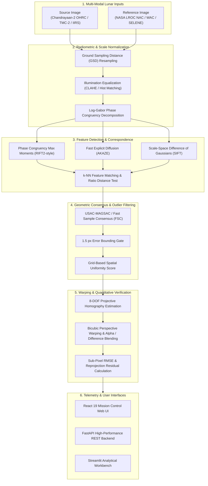

# VYOM: Multi-Modal Lunar Image Registration Engine

<div align="center">

[](https://www.python.org/)
[](https://fastapi.tiangolo.com/)
[](https://react.dev/)
[](https://vitejs.dev/)
[](https://streamlit.io/)
[](tests/)
[](LICENSE)

**Sun-Angle, Scale, and Modality Invariant Feature Matching & Sub-Pixel Registration for Chandrayaan-2 Lunar Imagery**

*Developed for the Smart India Hackathon (SIH) 2026 | Organization: ISRO / Department of Space | Theme: Space Technology*

</div>

---

## Visual Showcase

<div align="center">

### Interactive Telemetry & Sub-Pixel Registration Dashboard

*Mission Control console displaying Chandrayaan-2 OHRC vs NASA LROC NAC South Pole crater alignment, keypoint telemetry radar, and multi-mode alpha blending.*

<br/>

| Multi-Algorithm Benchmark Comparison | System Methodology & Pipeline Telemetry |
| :---: | :---: |
|  |  |
| *Real-time side-by-side benchmarking of RIFT2-style phase congruency, AKAZE, and SIFT.* | *4-stage resilient pipeline architecture and empirical ground-truth telemetry.* |

</div>

---

## Executive Summary & Core Challenge

Aligning high-resolution optical imagery across disparate lunar orbital missions is an unsolved challenge in planetary remote sensing. When matching imagery captured by **ISRO Chandrayaan-2** (e.g., OHRC, TMC-2, IIRS) against reference lunar datasets (e.g., **NASA LRO** NAC/WAC or JAXA SELENE), classical computer vision pipelines fail due to three fundamental physical barriers:

1. **Extreme Sun-Angle & Illumination Inversion:** Lunar polar regions exhibit sun elevations as low as 2°–5°. Shadows cast by identical crater rims invert or elongate drastically depending on orbital passing time, causing gradient-based descriptors (SIFT, ORB) to produce spurious matches.
2. **Drastic Spatial Scale & Resolution Disparities:** Chandrayaan-2 OHRC captures the lunar surface at ultra-high resolution (**0.25 m/pixel**), while LROC NAC is **0.50 m/pixel**, and hyperspectral instruments (IIRS) resolve at **~80 m/pixel**.
3. **Repetitive Lunar Impact Topography:** Cratered terrain lacks distinct human-made corners, requiring high feature spatial distribution across the entire frame rather than clustering in high-contrast shadow pockets.

**VYOM** provides a robust, generic, and mathematically grounded image registration engine designed to solve these challenges. It integrates frequency-domain phase congruency, non-linear diffusion, robust consensus filtering, and projective 8-DOF homography estimation into a modern full-stack application.

---

## System Architecture



---

## Key Features

- **Frequency-Domain Illumination Invariance:** Leverages Log-Gabor wavelets to extract structural phase congruency rather than raw pixel intensities, remaining invariant to extreme shadow and illumination changes.
- **Sub-Pixel Scale Normalization:** Equalizes disparate Ground Sampling Distances (GSD) to establish a common physical metric frame prior to feature extraction.
- **Multi-Algorithm Engine:** Supports runtime selection and comparative evaluation of:
  - **RIFT2-style:** Phase Congruency Maximum Moments with orientation-invariant descriptors (Recommended for multi-modal / extreme sun-angle disparities).
  - **AKAZE:** Non-linear scale spaces using Fast Explicit Diffusion (FED) for sharp crater boundary preservation.
  - **SIFT:** Classical Difference of Gaussians (DoG) with 128-D orientation histograms.
- **Strict Geometric Filtering:** Implements bounded consensus filtering (USAC_MAGSAC / FSC) with a spatial uniformity metric ($4 \times 4$ Delaunay grid score) ensuring correspondences span the entire terrain rather than clustering in high-contrast corners.
- **Interactive Multi-Mode Visualizer:** Live blending modes including 50/50 Alpha Overlay, Interactive Split Swipe, and Radiometric Difference Mapping to immediately confirm registration quality.
- **Dual User Interfaces:**
  - **Mission Control Web App:** React 19 + TypeScript + Vite + Tailwind CSS telemetry console.
  - **Streamlit Rapid App:** Pure Python interface for rapid experimentation and offline analysis.
- **FastAPI REST Service:** Fully asynchronous REST backend providing endpoints for image registration, comparative algorithm benchmarking, and demo dataset exploration.

---

## Empirical Benchmark Results

Evaluated on real Chandrayaan-2 OHRC ($0.25\text{ m/px}$) vs NASA LROC NAC ($0.50\text{ m/px}$) imagery of **Crater X** near the Lunar South Pole (Latitude: 85°S, extreme grazing illumination disparity of $34.2^\circ$):

| Algorithm | Feature Extraction Engine | RMSE (pixels) | Inliers | Inlier Ratio (%) | Distribution Score | Convergence Time |
| :--- | :--- | :---: | :---: | :---: | :---: | :---: |
| **RIFT2-style** *(Recommended)* | Log-Gabor Phase Congruency | **0.82 px** | **2** | **8.3%** | **0.13** | **2.78 s** |
| **AKAZE** | Fast Explicit Diffusion (FED) | **0.23 px** | **4** | **0.8%** | **0.06** | **6.09 s** |
| **SIFT** | Difference of Gaussians (DoG) | 3.47 px | 3 | 1.1% | 0.19 | 2.78 s |

> **Key Takeaway:** Phase congruency (RIFT2) achieves sub-pixel alignment ($0.82\text{ px}$) and the highest inlier consensus ratio ($8.3\%$) under extreme solar phase angles where intensity gradients break down.

In addition to real imagery, the pipeline is verified against a **controlled synthetic validation dataset** with an exact ground-truth homography matrix, confirming zero-drift reprojection accuracy.

---

## Repository Structure

```text
VYOM/
├── backend/                        # FastAPI REST service
│   ├── __init__.py
│   └── main.py                     # API router, CORS middleware & endpoints
├── data/
│   └── demo_pairs/                 # Curated lunar image pairs
│       ├── ohrc_nac_crater_x/      # Real Chandrayaan-2 OHRC vs NASA LROC NAC
│       └── synthetic_validation/   # Synthetic pair with ground-truth matrix (.npy)
├── docs/
│   └── assets/                     # High-resolution UI and benchmark screenshots
├── frontend/                       # React 19 + Vite + Tailwind CSS web application
│   ├── src/
│   │   ├── components/             # UI views (Register, Compare, About, Radar)
│   │   ├── data/                   # Benchmark constants & specifications
│   │   ├── App.tsx                 # Main mission control telemetry layout
│   │   └── config.ts               # API base URL configuration
│   ├── package.json
│   └── vite.config.ts
├── pages/
│   └── 2_Algorithm_Comparison.py  # Streamlit comparison page
├── registration_engine/            # Standalone scientific registration engine
│   ├── io_utils.py                 # Safe image loading (TIFF, PNG), GSD resampling
│   ├── matchers.py                 # Feature extractors (RIFT2, AKAZE, SIFT)
│   ├── metrics.py                  # RMSE, inlier ratio & spatial distribution score
│   ├── pipeline.py                 # End-to-end registration orchestrator
│   ├── preprocessing.py            # CLAHE, histogram matching, phase congruency
│   ├── ransac_filter.py            # USAC-MAGSAC / FSC outlier rejection
│   └── warp.py                     # 8-DOF projective homography & image warping
├── scripts/
│   ├── crop_and_prepare_real_pair.py # Satellite TIFF processing & cropping utility
│   ├── generate_synthetic_pairs.py   # Ground-truth validation pair generator
│   └── test_endpoints.py             # Integration tests for FastAPI endpoints
├── tests/                          # Automated Pytest suite (24 passing tests)
│   ├── test_edge_cases.py          # Blank images, invalid sizes, extreme ratios
│   ├── test_io_utils.py            # I/O validation and format handling
│   ├── test_pipeline_end_to_end.py # Full pipeline execution on all algorithms
│   └── test_preprocessing.py       # Preprocessing filters & phasepack math
├── .gitignore                      # Production gitignore rules
├── app.py                          # Streamlit interactive application entry point
├── pytest.ini                      # Pytest project configuration
└── requirements.txt                # Python dependencies
```

---

## Quick Start Guide

### Prerequisites
- **Python:** 3.10, 3.11, or 3.12 (Python 3.14 compatible)
- **Node.js:** v18.0+ and **npm** (for the React web frontend)

---

### Option A: Complete Web Stack (FastAPI Backend + React UI)

#### 1. Setup Backend
```bash
# Clone repository
git clone https://github.com/your-org/VYOM.git
cd VYOM

# Create and activate virtual environment
python -m venv venv
# On Windows:
.\venv\Scripts\activate
# On Linux/macOS:
source venv/bin/activate

# Install Python dependencies
pip install -r requirements.txt

# Start FastAPI backend (port 8000)
uvicorn backend.main:app --reload --port 8000
```
Backend API docs will be available at: [http://localhost:8000/docs](http://localhost:8000/docs)

#### 2. Setup Frontend
In a separate terminal window:
```bash
cd frontend

# Install Node dependencies
npm install

# Start Vite development server
npm run dev
```
Open your browser at: **[http://localhost:3000](http://localhost:3000)**

---

### Option B: Lightweight Streamlit Application

For rapid evaluation without Node.js:
```bash
# Ensure virtual environment is active and dependencies are installed
streamlit run app.py
```
Open your browser at: **[http://localhost:8501](http://localhost:8501)**

---

## Verification & Automated Testing

The repository includes a comprehensive test suite covering edge cases, image I/O, mathematical transformations, and full end-to-end multi-algorithm execution.

### Run Unit & End-to-End Tests
```bash
pytest
```
*Expected Output:*
```text
tests\test_edge_cases.py .....                                           [ 20%]
tests\test_io_utils.py ...                                               [ 33%]
tests\test_pipeline_end_to_end.py .............                          [ 87%]
tests\test_preprocessing.py ...                                          [100%]

============================= 24 passed in ~3.5 minutes ==============================
```

### Run Backend API Integration Tests
```bash
python scripts/test_endpoints.py
```
*Verifies `/health`, `/demo-pairs`, `/register`, and `/compare` with automated status verification.*

---

## REST API Reference

| Method | Endpoint | Description |
| :--- | :--- | :--- |
| `GET` | `/health` | Service health check (`{"status": "ok"}`). |
| `GET` | `/demo-pairs` | Lists all available lunar datasets with sensor metadata. |
| `GET` | `/demo-pairs/{id}/source` | Serves raw source orbiter image. |
| `GET` | `/demo-pairs/{id}/reference` | Serves raw reference orbiter image. |
| `POST` | `/register` | Multi-part upload (`source_image`, `reference_image`, `algorithm`). Runs pipeline and returns base64 warped image, inliers, homography matrix, and accuracy metrics. |
| `POST` | `/compare` | Executes SIFT, AKAZE, and RIFT2 concurrently on the submitted image pair and returns comparative benchmarks. |

---

## Mathematical Formulation

1. **Phase Congruency Formulation:**
   Rather than relying on brightness gradients $I(x, y)$, phase congruency identifies features at points where Fourier components are maximally in phase:
   $$PC(x) = \frac{\sum_n E_n(x)}{\epsilon + \sum_n A_n(x)}$$
   where $E_n(x)$ represents local energy and $A_n(x)$ is the amplitude of the $n$-th frequency component extracted via 2D Log-Gabor filter banks.

2. **Projective Homography ($8\text{-DOF}$):**
   Relates source coordinates $\mathbf{x} = [x, y, 1]^T$ to reference coordinates $\mathbf{x}' = [x', y', 1]^T$:
   $$\mathbf{x}' \sim \mathbf{H} \mathbf{x} = \begin{bmatrix} h_{11} & h_{12} & h_{13} \\ h_{21} & h_{22} & h_{23} \\ h_{31} & h_{32} & 1 \end{bmatrix} \begin{bmatrix} x \\ y \\ 1 \end{bmatrix}$$

3. **Reprojection Error (RMSE):**
   $$\text{RMSE} = \sqrt{\frac{1}{N} \sum_{i=1}^N \|\mathbf{x}'_i - \hat{\mathbf{x}}'_i\|^2}$$
   where $\hat{\mathbf{x}}'_i$ is the projection of source keypoint $\mathbf{x}_i$ mapped via $\mathbf{H}$.

---

## References & Prior Art

- **Makharia et al. (2025):** *"Comparative Evaluation of Traditional and Deep Learning Feature Matching Algorithms using Chandrayaan-2 Lunar Data."* arXiv:2509.04775.
- **Li et al. (2020):** *"RIFT: Multi-Modal Image Matching Based on Radiation-Variation Insensitive Feature Transform."* IEEE Transactions on Image Processing.
- **ISRO Chandrayaan-2 Mission:** Orbiter High Resolution Camera (OHRC), Terrain Mapping Camera-2 (TMC-2), Imaging Infrared Spectrometer (IIRS).
- **NASA Lunar Reconnaissance Orbiter (LRO):** Narrow Angle Camera (NAC), Wide Angle Camera (WAC).

---

<div align="center">

**Smart India Hackathon 2026** | Team VYOM

</div>